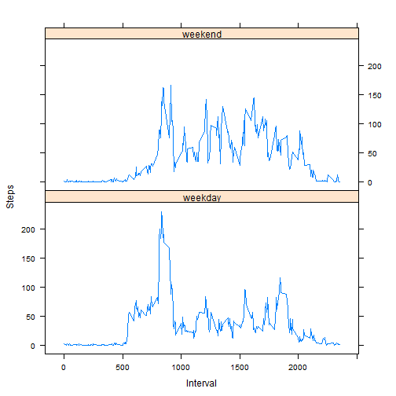

## Loading and preprocessing the data

```r
 library(knitr);
 datos <- read.csv("activity.csv")
```
## What is mean total number of steps taken per day?
I do aggregate steps by day

```r
pasos <- aggregate(steps ~ date, data = datos, sum, na.rm = TRUE)
```
The mean is:

```r
mean(pasos$steps)
```

```
## [1] 10766.19
```
The median is:

```r
median(pasos$steps)
```

```
## [1] 10765
```
The histogram is:

```r
hist(pasos$steps, main = "steps by day", xlab = "dia")
```

 

## What is the average daily activity pattern?


```r
daily <- tapply(datos$steps, datos$interval, mean, na.rm = TRUE)
plot(row.names(daily), 
     daily, type = "l", 
     xlab = "intervals", 
     ylab = "activity", 
     main = "mean steps")
```

 

5 min interval with max steps:

```r
which.max(daily)
```

```
## 835 
## 104
```


## Imputing missing values

number of rows with missing values:

```r
sum(is.na(datos))
```

```
## [1] 2304
```
we get a vector with the steps mean for each interval

```r
pasos_ <- aggregate(steps ~ interval, data = datos, mean)
```
we check every row of the original dataset checking if steps value is NA
if it is not we keep original value
if it is NA we assign steps mean for corresponding interval
that way we get a new steps vector with no NA values

```r
relleno <- numeric()
for (i in 1:nrow(datos)) {
    valor <- datos[i, ]$steps
    if (is.na(valor)) {
        susti <- subset(pasos_, interval == datos[i, ]$interval)$steps
    } else {
        susti <- valor
    }
    relleno <- c(relleno, susti)
}
```
we make a copy of the original dataset and substitute values for the steps

```r
datos2<-datos
datos2$steps<-relleno
```
with the new data
I do aggregate steps by day

```r
pasos2 <- aggregate(steps ~ date, data = datos2, sum, na.rm = TRUE)
```
The mean is:

```r
mean(pasos2$steps)
```

```
## [1] 10766.19
```
The median is:

```r
median(pasos2$steps)
```

```
## [1] 10766.19
```
The histogram is:

```r
hist(pasos2$steps, main = "steps by day", xlab = "dia")
```

 


## Are there differences in activity patterns between weekdays and weekends?

We add a column to the daset with value weekday or weekend depending no result of function weekdays over date:

```r
datos2$date <- as.Date(datos2$date, "%Y-%m-%d")
datos2$type <- "weekday"
datos2$type[weekdays(datos2$date) %in% c("Saturday","Sunday")] <- "weekend"
```
we do aggregate steps by interval and type of day and make the plot:

```r
pasos_dia <- aggregate(steps ~ interval + type, data = datos2, mean)
library(lattice)
xyplot(steps ~ interval | type,
       pasos_dia,
       type = "l",
       layout = c(1, 2), 
       xlab = "Interval", 
       ylab = "Steps")
```

 
